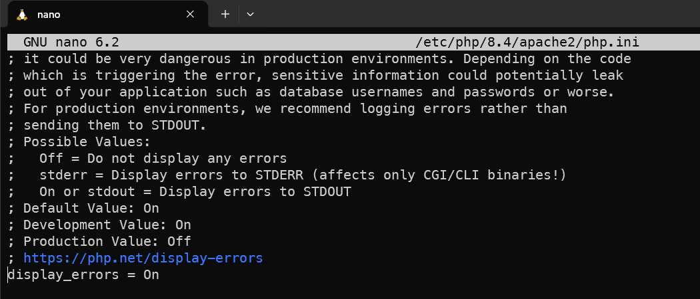
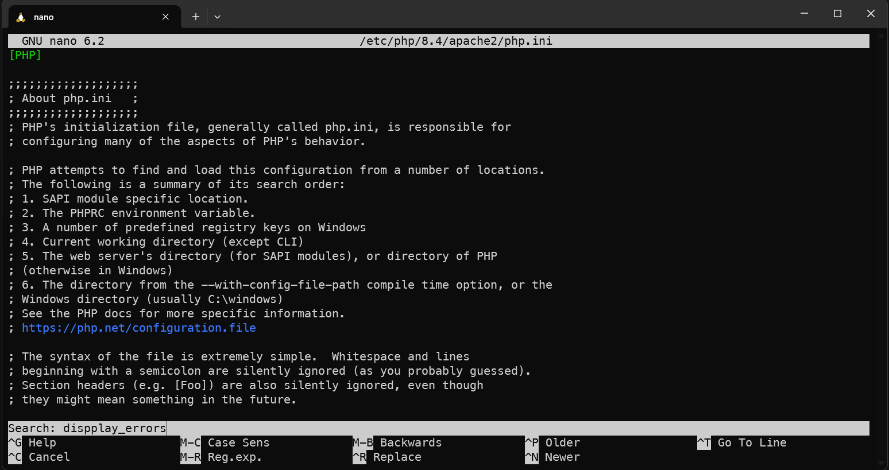

# Montar un entorno **LAMP** en **WSL2** (Ubuntu/Debian) para desarrollo local con

- **Linux** (WSL2)
- **Apache 2.4+ (Servidor Local)**
- **MariaDB** (recomendado) o **MySQL**
- **PHP 8.4** (multiples versiones con extensiones comunes)
- **phpMyAdmin** o Adminer (Opcional)
- (Recomendado) configuración segura y reproducible

> Nota: En WSL2, lo más estable es usar el stack **dentro de la distro Linux** (no mezclar binarios de Windows para servir en Linux).

---

## Requisitos

- Windows 10/11 con [**WSL**](Gu%C3%ADa%20para%20instalar%20WSL2.md)
- Una distro como **Ubuntu 22.04/24.04** (recomendado)
- Terminal Windows / Windows Terminal

---

## Actualizar el sistema (dentro de WSL)

```bash
sudo apt update && sudo apt -y upgrade
```

## 1) Agregar Repositorios PPA

En distros como Ubuntu/Debian cuentan con repositorios oficiales que proporcionan versiones estables de sus paquetes. Sin embargo, en algunas ocasiones podemos necesitar trabajar con versiones más recientes que todavía no están disponibles en los repositorios oficiales de la distribución, o bien con versiones anteriores por cuestiones de compatibilidad.

Para estos casos, podemos utilizar los repositorios mantenidos por **Ondřej Surý**, que proporcionan versiones actualizadas de PHP y Apache para Ubuntu y Debian.

```bash
sudo apt -y install software-properties-common
sudo add-apt-repository ppa:ondrej/php
sudo add-apt-repository ppa:ondrej/apache2
sudo apt update
```

### Instalar PHP

Una vez que hemos agregado el repositorio, podemos instalar la versión de PHP que queremos utilizar en nuestro sistema o proyecto.

```bash
sudo apt intall php8.4 -y
```

Si necesitamos trabajar con varias versiones de PHP, podemos instalarlas en un mismo comando indicando cada paquete por separado

```bash
sudo apt install php8.3 php8.4 php7.6 -y
```

### Instalar Apache

Para insstalr nuestro Servidor Local paro poder ver nuestros proyectos en un navegador ingresaremos el siguienter comando

```bash
sudo apt install apache2 -y
```

#### Comandos para Apache

Comprobar la versión instalada

```bash
apache2 -v
```

Comprobar el estado del servicio ( esta corriendo o esta detenido )

```bash
sudo systemctl status apache2
```

o

```bash
sudo service apache2 status
```

Apagar Apache

```bash
sudo systemctl stop apache2
```

o

```bash
sudo service apache2 stop
```

Arrancar Apache

```bash
sudo systemctl start apache2
```

o

```bash
sudo service apache2 start
```

reiniciar Apache

```bash
sudo systemctl restart apache2
```

o

```bash
sudo service apache2 restart
```

### Ligar PHP a Apache

Una vez instalado Apache, instalamos PHP 8.4 junto con `libapache2-mod-php8.4`, que permite que Apache procese archivos PHP directamente mediante el módulo de PHP

```bash
sudo apt install libapache2-mod-php8.4 -y
```

Es necesario configurar Apache para que pueda procesar archivos PHP. De esta forma, cuando Apache reciba una solicitud hacia un archivo `.php`, podrá ejecutar el código mediante PHP y devolver al navegador el resultado correspondiente.

Para habilitar PHP 8.4 en Apache utilizamos el comando:

```bash
sudo a2enmod php8.4
```

El comando `a2enmod` se utiliza en Ubuntu y Debian para **habilitar módulos de Apache**. En este caso, estamos habilitando el módulo que permite a Apache trabajar con PHP 8.4.

Es necearios reiniciar los servicios de Apache

```bash
sudo systemctl restart apache2
```

### Configurar PHP para mostrar errores

Durante el desarrollo es normal cometer errores mientras escribimos y probamos nuestro código. PHP puede detectar estos problemas y generar mensajes de error que nos indican qué está ocurriendo y, en muchos casos, en qué archivo y línea se encuentra el problema.

Por lo tanto, en nuestro entorno local vamos a configurar PHP para que muestre los errores mientras desarrollamos. Para ello, modificaremos el archivo de configuración de PHP utilizado por Apache.

```bash
sudo nano /etc/php/8.4/apache2/php.ini
```

Este comando nos abrirá un editor en la terminal, el cual manejaremos utilizando las teclas de **flecha** y diferentes combinaciones de teclas.

Como primera combinación, utilizaremos:

```bash
Ctrl + W
```

Esta combinación nos permitirá buscar texto de una forma más rápida dentro del archivo. En este caso, la palabra que buscaremos será:

```bash
display_errors
```



Al presionar **Enter**, nos mostrará una coincidencia, pero esta no será la opción que buscamos. Por lo tanto, debemos continuar con la búsqueda de `display_errors`.

El editor mantiene en memoria nuestra última búsqueda, así que no es necesario volver a escribir la palabra. Simplemente presionamos nuevamente:

```bash
Ctrl + W
```

y después **Enter** para continuar con la búsqueda hasta encontrar el texto que necesitamos. utilizaremos las **teclas de flecha** para desplazarnos hacia la derecha hasta llegar al valor `Off`. Después, eliminaremos `Off` y lo cambiaremos por `On`, de manera que quede:

```bash
display_errors = On
```



Cuando terminemos, guardaremos los cambios utilizando la combinación de teclas:

```bash
Ctrl + O
```

Después, presionamos **Enter** para confirmar y guardar los cambios.

Para salir del editor, presionamos:

```bash
Ctrl + X
```

### Área de trabajo

Para comenzar a trabajar con nuestros proyectos, debemos ubicarnos en la carpeta donde Apache almacena los archivos que serán servidos por el servidor web:

```bash
cd /var/www/html
```

Esta es la carpeta que Apache utiliza por defecto como **directorio raíz** para servir nuestros proyectos. Por lo tanto, los proyectos que queramos ejecutar mediante Apache deberán encontrarse dentro de esta ubicación o configurarse mediante un Virtual Host.

Al ingresar a esta carpeta, encontraremos por defecto un archivo llamado `index.html`. Este archivo pertenece a la página de bienvenida de Apache que se muestra cuando accedemos en navegador a:

```txt
<http://localhost>
```

Apache busca automáticamente un archivo de inicio, como `index.html` o `index.php`. Por esta razón, mientras exista `index.html`, Apache mostrará la página predeterminada en lugar de nuestro código PHP.

Podemos eliminar este archivo sin afectar el funcionamiento del servicio de Apache:

```bash
sudo rm index.html
```

Ahora crearemos nuestro propio archivo de inicio utilizando PHP:

```bash
sudo nano index.php
```

Dentro del archivo escribiremos:

```php
<?php
phpinfo();
?>
```

La función `phpinfo()` nos permitirá visualizar información detallada sobre la instalación de PHP, incluyendo su versión, configuración y los módulos que se encuentran habilitados.

Una vez guardado el archivo, podemos abrir nuevamente:

```txt
<http://localhost>
```

Apache encontrará `index.php` y PHP procesará el archivo, mostrando en el navegador la información de nuestra instalación de PHP.

### Multiples versiones de PHP

Ubuntu y Debian permiten instalar múltiples versiones de PHP en un mismo sistema. Esto resulta especialmente útil cuando trabajamos con diferentes proyectos que requieren versiones específicas de PHP.

Pero, ¿tener varias versiones instaladas puede representar un problema? **No necesariamente.** El problema no está en tener varias versiones instaladas, sino en determinar cuál de ellas utilizará Apache para procesar nuestros proyectos.

Por ejemplo, podemos tener instaladas PHP 8.3 y PHP 8.4 al mismo tiempo. Sin embargo, Apache debe tener una versión de PHP habilitada para atender las solicitudes de nuestros archivos `.php`.

Por esta razón, cuando trabajamos con múltiples versiones debemos establecer cuál será la versión que utilizaremos de forma predeterminada y, cuando sea necesario, cambiarla según los requerimientos de nuestro proyecto.

Para consultar las versiones de PHP instaladas podemos utilizar:

```bash
ls /etc/php/
```

Y para comprobar qué versión está utilizando actualmente la terminal:

```bash
php -v
```

En el caso de Apache, también debemos administrar el módulo de PHP que se encuentra habilitado. Por ejemplo, si queremos que Apache utilice PHP 7.5, debemos habilitar su módulo:

```bash
sudo a2enmod php7.5
```

y deshabilitar el de otra versión si estuviera activo:

```bash
sudo a2dismod php8.4
```

Finalmente, reiniciamos Apache para aplicar los cambios:

```bash
sudo service apache2 restart
```

Es importante tener en cuenta que **cada versión de PHP cuenta con su propio archivo de configuración `php.ini`**. Por lo tanto, si cambiamos la versión que utiliza Apache, también debemos revisar y configurar el `php.ini` correspondiente a esa versión. Por ejemplo, para PHP 8.4:

```bash
sudo nano /etc/php/7.5/apache2/php.ini
```

De esta manera podemos mantener varias versiones de PHP instaladas y seleccionar cuál queremos utilizar, tanto desde la terminal como desde Apache, manteniendo además la configuración correspondiente para cada versión.

---

## 2) Instalar base de datos (MariaDB recomendado)

---

## 8) phpMyAdmin (opcional) o Adminer (más simple)

---
